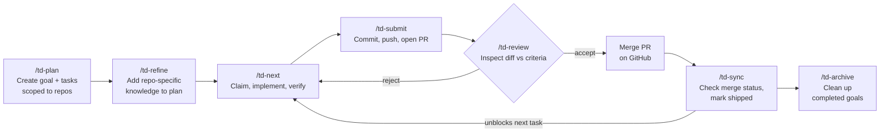

# Tendrils (`td`)

A CLI tool for managing work that LLM agents can collaborate on across repos.

Tendrils organizes work as a **map**: Goals > Tasks. Agents can claim work, update status, and log progress — all from the command line with structured JSON output.

## Install

**Latest build** (recommended):

```bash
npm install -g https://github.com/markthiessen/tendrils/releases/download/latest/tendrils-latest.tgz
```

**Local development**:

```bash
git clone git@github.com:markthiessen/tendrils.git
cd tendrils
npm install
npm link
```

## Getting Started

### 1. Initialize a workspace

```bash
cd your-repo
td init my_project --role api
```

This creates a workspace database at `~/.tendrils/workspaces/my-project/map.db`, binds the current directory via `.tendrils/config.toml`, and adds `.tendrils/` to `.gitignore`.

### 2. Install Claude Code commands

```bash
td claude install        # Local to this project
td claude install -g     # Global (all projects)
td claude status         # Check what's installed
td claude uninstall      # Remove commands
```

This installs slash commands that drive the full workflow from inside Claude Code: `/td-discover`, `/td-plan`, `/td-next`, `/td-status`, `/td-refine`, `/td-review`, `/td-submit`, `/td-archive`, and `/td-sync`.

### 3. Discover the codebase

Run `/td-discover` in Claude Code. The agent analyzes the repo — recording technical decisions (stack, conventions, features already built) and building a shared Mermaid architecture diagram. This gives all future planning and implementation the context it needs.

### 4. Plan and work

Run `/td-plan` to create goals and tasks, then `/td-next` to start working. See [Workflow](#workflow) for the full lifecycle.

## Workflow

The `/td-*` slash commands in Claude Code drive a feature from planning through shipping:



| Step | Command | What it does |
|------|---------|-------------|
| **Plan** | `/td-plan` | Creates goals and tasks scoped to repos, wires up dependencies |
| **Refine** | `/td-refine` | Adds local file paths and context to tasks planned from other repos |
| **Work** | `/td-next` | Claims the next ready task, implements, verifies against acceptance criteria |
| **Submit** | `/td-submit` | Commits changes, pushes branch, opens PR, links task |
| **Review** | `/td-review` | Inspects diff against criteria on five axes — accepts or rejects with feedback |
| **Sync** | `/td-sync` | Checks GitHub for merged PRs, marks shipped, unblocks dependents |
| **Archive** | `/td-archive` | Retires completed goals from the active map |

Use `/td-status` at any point to see the current map, progress, and recent activity.

### Single-repo example

```
/td-plan add user authentication
  → Creates G01 with tasks for login, signup, OAuth

/td-next
  → Claims G01.T001, implements login endpoint, submits for review

/td-review
  → Checks the diff, accepts or rejects with feedback

/td-submit
  → Commits, pushes, creates PR

/td-sync
  → Marks shipped after PR merges
```

### Multi-repo example

In a workspace with `api`, `web`, and `infra` repos:

**From any repo**, run `/td-plan`. The planner sees the architecture diagram and all repos' decisions. It creates tasks scoped to each repo with cross-repo dependencies:

```
G01  User Authentication
 ├─ G01.T001  POST /auth/login endpoint          (api)    ← depends on T003
 ├─ G01.T002  Login form component                (web)   ← depends on T001
 └─ G01.T003  Add auth DB migration               (infra)
```

**In each repo**, run `/td-refine`. The agent explores the local codebase and appends entry points to tasks — the one thing the planner couldn't provide from another repo.

**Then work in parallel.** Run `/td-next` in each repo. Agents only see tasks for their repo's role, and dependencies unblock automatically:

```
~/code/infra  →  /td-next picks up G01.T003 (ready)
~/code/api    →  /td-next sees G01.T001 (blocked — waiting on G01.T003)
~/code/web    →  /td-next sees G01.T002 (blocked — waiting on G01.T001)
```

As the infra agent completes its task, the api task unblocks. When the api task finishes, the web task unblocks. Each agent picks up work in the right order — without a central orchestrator.

**Submit and review per repo.** When an agent finishes, run `/td-submit` in that repo to commit, push, and open a PR. Run `/td-review` to inspect the work — rejected tasks go back to the agent with specific feedback.

**Sync across the workspace.** After merging PRs, run `/td-sync` from any repo to mark shipped tasks across the entire workspace in one pass.

## Concepts

### Map Hierarchy

```
Goal (G01)              — a high-level outcome ("User Authentication")
  └─ Task (G01.T001)   — a claimable unit of work ("OAuth2 support")
```

Goals form the horizontal backbone. Tasks stack vertically under goals, ordered by priority.

### Hierarchical IDs

Every item gets a stable, human-readable ID:

| Entity | Format         | Example    |
|--------|----------------|------------|
| Goal   | `G{nn}`        | `G01`      |
| Task   | `G{nn}.T{nnn}` | `G01.T001` |

Fully qualified with workspace: `my_project::G01.T001`

### Task Statuses

```
backlog → ready → claimed → in-progress → review → done
                                ↓            ↓
                             blocked      in-progress
```

- Any active status can transition to `cancelled`.
- `done` can reopen to `ready`.
- `cancelled` can reopen to `backlog` or `ready`.

### Task Dependencies

Tasks can declare dependencies on other tasks. A task with unsatisfied dependencies is automatically blocked and unblocked when its dependencies complete.

```bash
td task depends G01.T002 --on G01.T001    # T002 waits for T001
td task deps G01.T002                      # Show dependency tree
td task undepends G01.T002 --on G01.T001   # Remove dependency
```

Circular dependencies are detected and rejected.

### Decisions and Architecture

Each repo can record technical decisions — architectural choices, conventions, and patterns that give agents context about the codebase:

```bash
td decide "Framework: Express with TypeScript" --tag stack
td decide "All endpoints return {ok, data, error} envelope" --tag convention,api
td decisions                    # List this repo's decisions
td undecide <id>                # Remove a decision
```

The workspace shares a Mermaid architecture diagram across all repos:

```bash
td arch set "graph LR; API-->DB; Web-->API"
td arch show                               # Display diagram and notes
td arch note API "Express + TypeScript"    # Annotate a node
```

Decisions are per-repo and survive workspace switches. Use `/td-discover` to seed both decisions and the architecture diagram from an existing codebase.

## Multi-Repo Workspaces

Tendrils stores all data in `~/.tendrils/`, keeping your repos clean. Multiple repos can share one workspace:

```bash
# Bind different repos to the same workspace with roles
cd ~/code/backend && td init my_project --role api
cd ~/code/frontend && td init my_project --role web
cd ~/code/analytics && td init my_project --role analytics

# Check current configuration
td status
td repos                  # List repos in workspace

# Switch all repos to a new workstream
td workspace switch sprint-2
td workspace list          # List all workspaces
```

Workspace is resolved in order: `--workspace` flag, `TD_WORKSPACE` env var, `.tendrils/config.toml` in current/parent directory, binding path match, or auto-detected if only one workspace exists.

## Web UI

Launch a local dashboard to visualize the map:

```bash
td ui                    # Opens browser on port 24242
td ui --port 3000        # Custom port
```

## CLI Reference

Every command supports `--json` for machine-readable output and `-w, --workspace <name>` to override the workspace.

### Global Options

| Flag | Purpose |
|------|---------|
| `--json` | Machine-readable JSON output |
| `-w, --workspace <name>` | Override workspace |
| `-q, --quiet` | Suppress non-essential output |
| `-v, --verbose` | Increase detail level |

### Goals

| Command | Purpose |
|---------|---------|
| `td goal add <title>` | Create a goal |
| `td goal list` | List all goals |
| `td goal show <id>` | Show goal details |
| `td goal edit <id>` | Edit a goal |
| `td goal rm <id>` | Remove a goal |
| `td goal archive <id>` | Archive a completed goal |
| `td goal reorder <id> <position>` | Reorder a goal |

### Tasks

| Command | Purpose |
|---------|---------|
| `td task add <goal-id> <title>` | Create a task (with optional `--repo`) |
| `td task list [goal-id]` | List tasks |
| `td task show <id>` | Show task details |
| `td task edit <id>` | Edit a task |
| `td task rm <id>` | Remove a task |
| `td task status <id> <status>` | Change task status |
| `td task claim <id> --agent <name>` | Claim a task |
| `td task unclaim <id>` | Release a claimed task |
| `td task move <id> <goal-id>` | Move task to a different goal |
| `td task reorder <id> <position>` | Reorder a task |
| `td task accept <id>` | Accept a task in review |
| `td task reject <id> -m <reason>` | Send a task back with feedback |
| `td task ship <id>` | Mark as shipped |
| `td task depends <id> --on <dep-id>` | Add a dependency |
| `td task undepends <id> --on <dep-id>` | Remove a dependency |
| `td task deps <id>` | Show dependency tree |

### Other

| Command | Purpose |
|---------|---------|
| `td next` | Pick the next ready task |
| `td log <id> <message>` | Log progress on a task |
| `td history [id]` | Show work log / recent activity |
| `td map` | Render the map |
| `td stats` | Summary statistics |
| `td status` | Current repo and workspace config |
| `td repos` | List repos in workspace |
| `td sync` | Sync task status with GitHub PRs |
| `td ui` | Launch web dashboard |
| `td decide <text>` | Record a decision |
| `td undecide <id>` | Remove a decision |
| `td decisions` | List decisions |
| `td arch show` | Show architecture diagram |
| `td arch set <mermaid>` | Set architecture diagram |
| `td arch note <node> <text>` | Annotate a diagram node |
| `td workspace switch <name>` | Switch workspace |
| `td workspace list` | List workspaces |
| `td workspace info` | Workspace details |
| `td claude install [-g]` | Install Claude Code commands |
| `td claude uninstall` | Remove Claude Code commands |
| `td claude status` | Check installation status |

## Environment Variables

| Variable      | Purpose                                   |
|--------------|-------------------------------------------|
| `TD_HOME`    | Override `~/.tendrils` (useful for testing) |
| `TD_WORKSPACE`| Set default workspace                     |
| `TD_AGENT`   | Set default agent name for claim/log       |

## Configuration

Workspace-level config lives at `~/.tendrils/workspaces/<name>/config.toml` and supports:

| Field | Purpose |
|-------|---------|
| `max_agents_per_repo` | Limit concurrent agents per repo (0 = no limit) |

## Development

```bash
npm install          # Install dependencies
npm run build        # Compile TypeScript
npm run build:all    # Build code and web UI
npm run dev          # Run via tsx (no build needed)
npm test             # Run tests
npm run test:watch   # Run tests in watch mode
```
